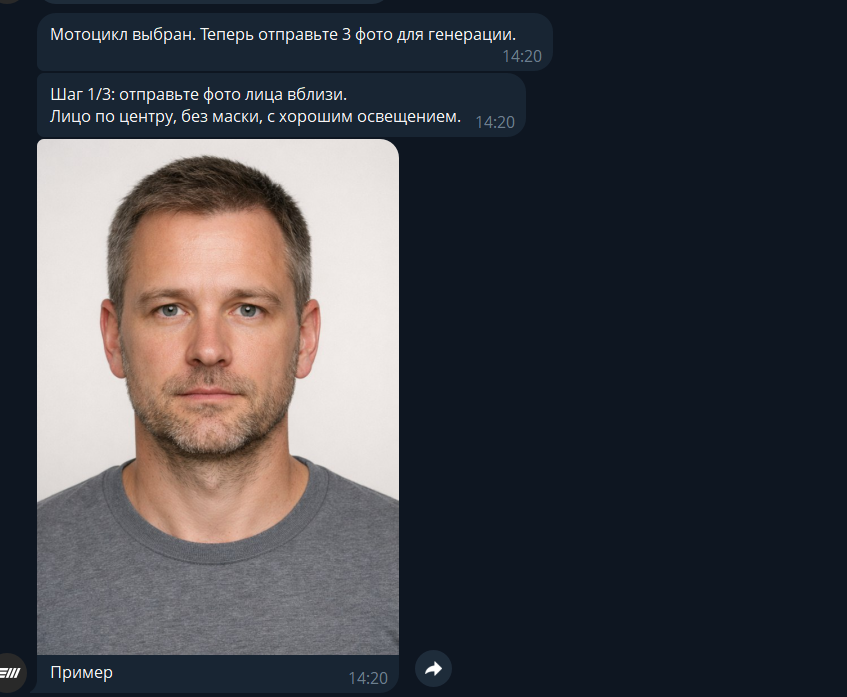
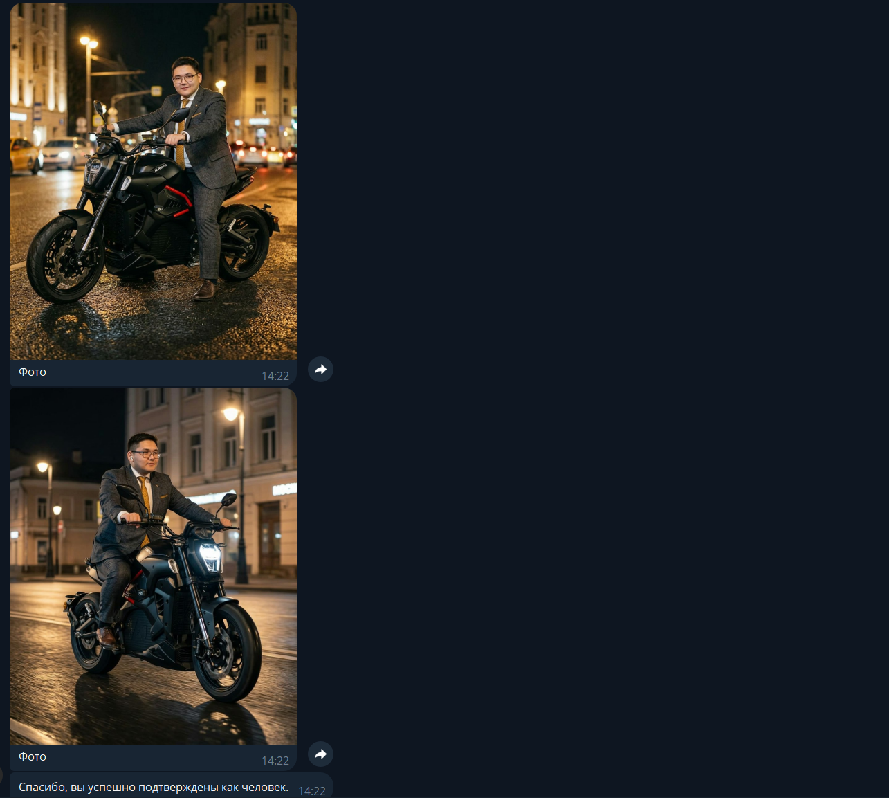
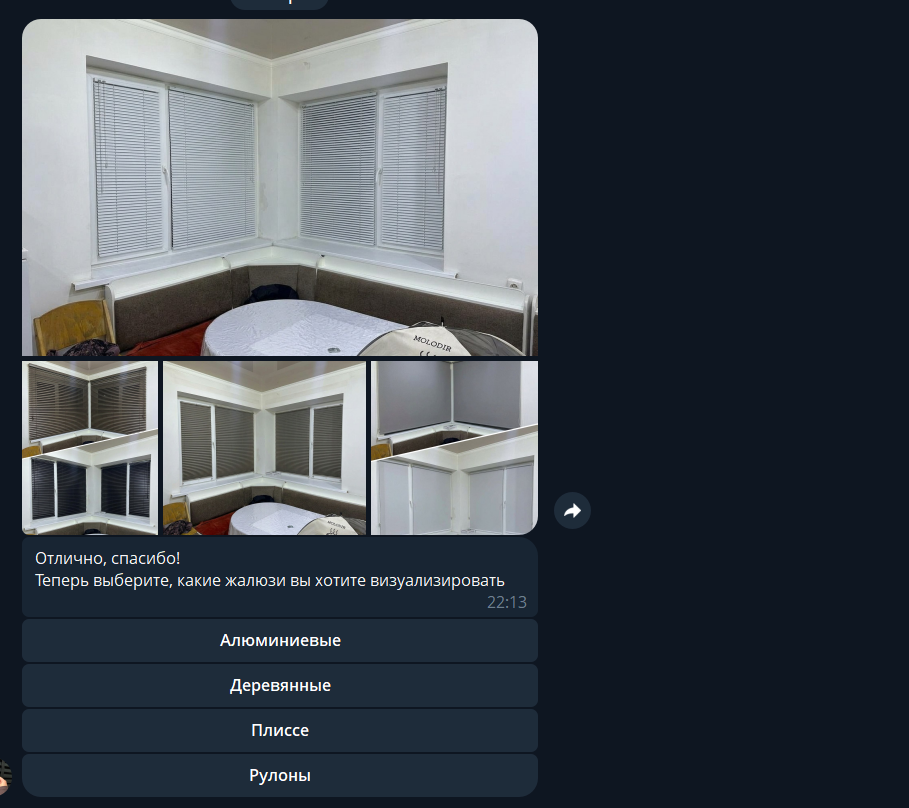
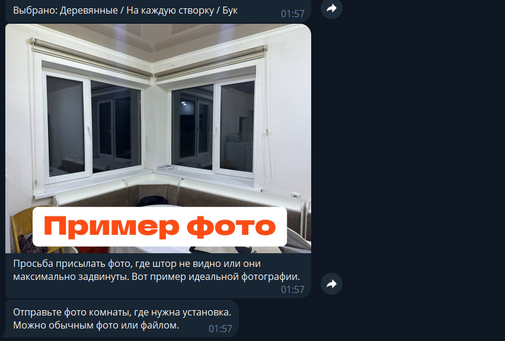
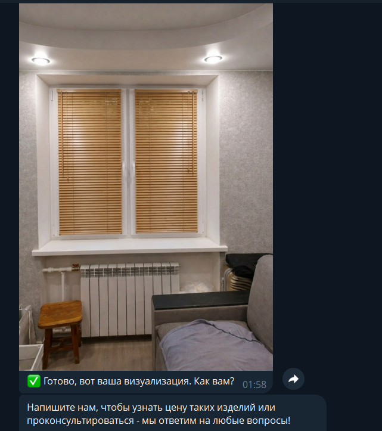

# AI Virtual Try-On Bot

Telegram bot that lets customers visualize products in their space using AI image generation.

**How it works:** User selects a product category → picks options (style, color) → uploads a photo of their room/space → bot generates a realistic preview with the selected product.

## Use Cases

| Industry | What it does |
|----------|-------------|
| Curtains & blinds | Preview how curtains look on your window |
| Furniture | See how a sofa fits in your living room |
| Automotive tuning | Visualize body kits on your car |
| Interior design | Try different wall colors, tiles, wallpaper |
| Fashion & accessories | Virtual try-on for glasses, jewelry |

This repo includes a **working demo for curtains** — adapt the product catalog for your niche.

## Features

- Step-by-step product selection via inline buttons (FSM)
- AI image generation via [NanoBanana API](https://nanobananaapi.ai)
- Reference image catalog system (folder-based, easy to extend)
- Lead collection (name, phone) with JSONL storage
- CRM integration ready (Bitrix24, Envy CRM)
- Anti-bot check before showing results
- VPS deployment script (systemd + Paramiko)
- Blur preview until lead form is completed

## Tech Stack

- **Python 3.11+**
- **aiogram 3.x** — async Telegram bot framework
- **NanoBanana API** — AI image generation (inpainting / virtual try-on)
- **Pillow** — image processing
- **Paramiko** — SSH deployment to VPS

## Quick Start

### 1. Clone & install

```bash
git clone https://github.com/nurbekov9999-sys/ai-tryon-bot.git
cd ai-tryon-bot
python -m venv .venv
.venv/Scripts/activate  # Windows
# source .venv/bin/activate  # Linux/Mac
pip install -r requirements.txt
```

### 2. Configure

```bash
cp .env.example .env
# Edit .env — fill in your API keys
```

Required keys:
- `TELEGRAM_BOT_TOKEN` — from [@BotFather](https://t.me/BotFather)
- `NANOBANANA_API_KEY` — from [nanobananaapi.ai](https://nanobananaapi.ai)

### 3. Add your product catalog

Create a folder structure:

```
ReferenceStore/
  Product Type A/
    Variant 1/
      Color 1/
        reference1.jpg
        reference2.jpg
      Color 2/
        reference1.jpg
    Variant 2/
      Color 1/
        reference1.jpg
  Product Type B/
    ...
```

The bot auto-discovers categories from folder names. Just drop your reference images and restart.

### 4. Run

```bash
python src/simple_curtain_bot.py
```

## Deploy to VPS

```bash
python execution/vps_deploy_curtain_bot.py \
  --remote-root /root/projects/tryon-bot \
  --service tryon-bot
```

Creates a systemd service that auto-restarts on failure.

## Project Structure

```
ai-tryon-bot/
├── src/
│   ├── simple_curtain_bot.py      # Main bot logic (FSM, handlers, API calls)
│   └── reference_store_catalog.py # Catalog loader (reads folder structure)
├── execution/
│   ├── vps_deploy_curtain_bot.py  # One-command VPS deployment
│   └── vps_exec.py               # Remote command execution
├── ReferenceStore/                # Your product reference images (not in repo)
├── .env.example                   # Environment variables template
├── requirements.txt
└── README.md
```

## Adapting for Your Niche

1. **Replace the catalog** — create `ReferenceStore/` with your product categories
2. **Edit prompts** — update AI generation prompts in the bot for your product type
3. **Customize messages** — change bot text/buttons for your language and branding
4. **Optional: CRM** — connect Bitrix24 or Envy CRM for lead routing

## Screenshots

### Motorcycle Virtual Try-On
User uploads 3 photos → AI generates realistic images of the person on a motorcycle.





### Curtain / Blinds Virtual Try-On
User uploads a room photo → selects curtain type and color → AI generates a preview.





## License

MIT

## Author

Built by [Aman](https://t.me/A12322331) — AI automation engineer specializing in Telegram bots, CRM integrations, and business process automation.

Need a similar bot for your business? [Contact me on Telegram](https://t.me/A12322331).
